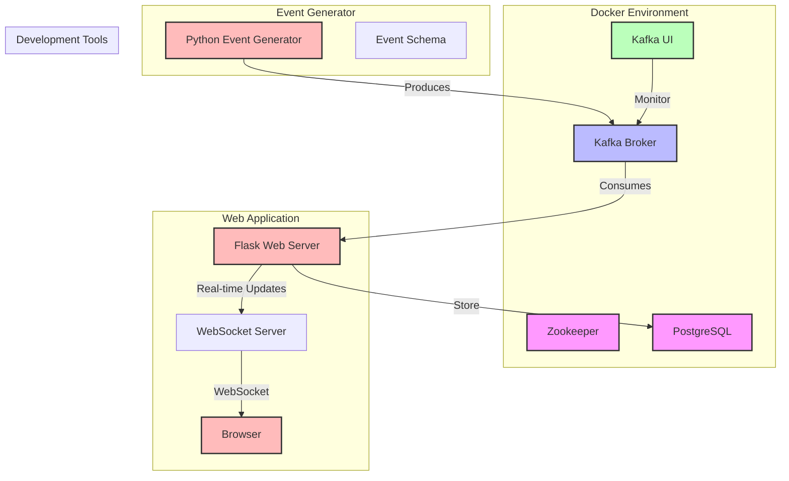

# Data Ingestion Factory

This repository contains a Docker Compose setup for a local Kafka development environment, a kafka event generator, and a real-time message viewer web application.

## 1. Architecture Overview



## Setup and run the Development Environment 
###Prerequisites

- Homebrew (for macOS)
- Git
- Python 3.7+
- pip (Python package manager)

### Docker Setup with Colima (macOS)

Instead of Docker Desktop, this setup uses Colima as a lightweight Docker runtime for macOS.

1. Install Colima and Docker CLI tools:
   ```bash
   brew install colima docker docker-compose
   ```

2. Start Colima:
   
   Basic setup (2 CPUs, 4GB memory)
   ```bash colima start```

   Or for more resources:
   ```bash colima start --cpu 4 --memory 8 --disk 100
   ```

3. Verify Docker is working:
   ```bash
   docker ps
   ```

#### Colima Management Commands

- Check Colima status:
  ```bash
  colima status
  ```

- Stop Colima:
  ```bash
  colima stop
  ```

- Delete Colima instance:
  ```bash
  colima delete
  ```

- List running instances:
  ```bash
  colima list
  ```

**Note**: Always ensure Colima is running before using Docker commands. If you see errors about Docker daemon not being available, start Colima first.

### Getting Started

1. Clone this repository:
   ```bash
   git clone <repository-url>
   cd <repository-name>
   ```

2. Start the Kafka environment:
   ```bash
   docker-compose up -d
   ```

3. Verify the services are running:
   ```bash
   docker-compose ps
   ```

### Services

The following services will be available:

- **Zookeeper**: Running on port 2181
- **Kafka Broker**: Running on ports:
  - 9092 (for local machine access)
  - 29092 (for inter-container access)
- **Kafka UI**: Access the web interface at http://localhost:8080
- **Kafka Message Viewer**: Access the web interface at http://localhost:5000
- **PostgreSQL**: Running on port 5432

### Using Kafka

#### Connection Details

- Bootstrap Servers: `localhost:9092` (from your local machine)
- Bootstrap Servers: `kafka:29092` (from other containers)

#### Kafka UI

The Kafka UI provides a web interface to:
- Monitor topics, partitions, and messages
- Create and delete topics
- View consumer groups
- Browse messages

Access it at: http://localhost:8080

### PostgreSQL Database

The environment includes a PostgreSQL database for persistent storage of Kafka events.

#### Connection Details

- **Host**: `localhost` (or `postgres` from other containers)
- **Port**: `5432`
- **Database**: `kafka_events`
- **Username**: `postgres`
- **Password**: `postgres`

#### Data Persistence

The database data is persisted using a Docker volume named `postgres_data`. This ensures that your data remains intact even if you stop or restart the containers.

#### Health Checks

The PostgreSQL service includes health checks to ensure it's running properly. You can monitor the health status using:

```bash
docker-compose ps postgres
```

#### Notes

- The database is initialized with a default database named `kafka_events`
- Data is persisted between container restarts
- The database uses PostgreSQL 16 Alpine for a lightweight footprint
- The service includes automatic health checks

## 2. Kafka Message Viewer Web Application

This repository includes a real-time web application for viewing Kafka messages as they arrive.

### Features

- Real-time message consumption and display
- Modern, responsive UI using Tailwind CSS
- WebSocket-based updates for instant message display
- JSON message pretty-printing
- Message metadata display (topic, partition, offset, timestamp)
- Message count tracking
- Scrollable message history
- Maintains last 100 messages in memory

### Installation

1. Install the required Python packages if you haven't already:
   ```bash
   pip install -r requirements.txt
   ```

### Usage

1. Start the web application:
   ```bash
   python webapp/app.py
   ```

2. Open your browser and navigate to:
   ```
   http://localhost:5000
   ```

The web application will automatically:
- Connect to your Kafka cluster at `localhost:9092`
- Subscribe to all available topics
- Display new messages in real-time at the top of the page
- Format and pretty-print JSON messages for readability

### Architecture

The application consists of two main components:

1. **Backend (`webapp/app.py`)**:
   - Flask web server
   - Kafka consumer running in a background thread
   - WebSocket server for real-time updates
   - Message management and storage

2. **Frontend (`webapp/templates/index.html`)**:
   - Responsive UI built with Tailwind CSS
   - WebSocket client for real-time updates
   - Dynamic message rendering
   - JSON formatting and display

### Notes

- The web application requires an active Kafka cluster (see "Getting Started" section)
- Messages are stored in memory and will be cleared when the application restarts
- The UI is optimized for both desktop and mobile viewing
- The application keeps only the latest 100 messages to manage memory usage

### Troubleshooting

If you encounter any issues with the web application:

1. Ensure the Kafka cluster is running and accessible
2. Check that port 5000 is available on your machine
3. Verify all dependencies are installed correctly
4. Check the terminal output for any error messages
5. Ensure the Kafka broker is accessible at `localhost:9092`

## Stopping the Environment

To stop all services:
```bash
docker-compose down
```

To stop all services and delete all data:
```bash
docker-compose down -v
```

## Troubleshooting

If you encounter any issues:

1. Check service logs:
   ```bash
   docker-compose logs -f [service_name]
   ```

2. Ensure all ports (2181, 9092, 29092, 8080, 5000) are available on your machine

3. Restart the services:
   ```bash
   docker-compose restart
   ```

## Notes

- This is a development setup and should not be used in production
- The environment uses a single Kafka broker with replication factor 1
- Data is persisted between restarts unless you use `docker-compose down -v`

## 3.Event Generator

This repository includes a Python-based event generator that can create and publish random events to Kafka based on a JSON schema.

### Prerequisites

- Python 3.7+
- pip (Python package manager)

### Installation

1. Install the required Python packages:
   ```bash
   pip install -r requirements.txt
   ```

### Usage

The event generator can be used from the command line with the following syntax:

```bash
python event_generator/event_generator.py [TOPIC] [SCHEMA_FILE] [OPTIONS]
```

Arguments:
- `TOPIC`: The Kafka topic to publish events to
- `SCHEMA_FILE`: Path to the JSON schema file that defines the event structure

Options:
- `--num-events`: Number of events to generate (default: 10)
- `--bootstrap-servers`: Kafka bootstrap servers (default: "localhost:9092")

Example usage:

```bash
# Generate 100 events using the example schema
python event_generator/event_generator.py my-topic event_generator/example_schema.json --num-events 100
```

### Example Schema

An example schema file is provided in `event_generator/example_schema.json`. This schema generates events with the following structure:

```json
{
  "event_id": "uuid",
  "timestamp": "date-time",
  "user": {
    "id": "integer",
    "email": "email",
    "name": "string"
  },
  "order": {
    "order_id": "string",
    "items": [
      {
        "product_id": "string",
        "quantity": "integer",
        "price": "number"
      }
    ],
    "total_amount": "number"
  }
}
```

### Creating Custom Schemas

You can create your own JSON schemas following the JSON Schema specification. The event generator supports:
- Basic types: string, integer, number, boolean, array, object
- String formats: date-time, uuid, email
- Array constraints: minItems, maxItems
- Required fields
- Nested objects and arrays